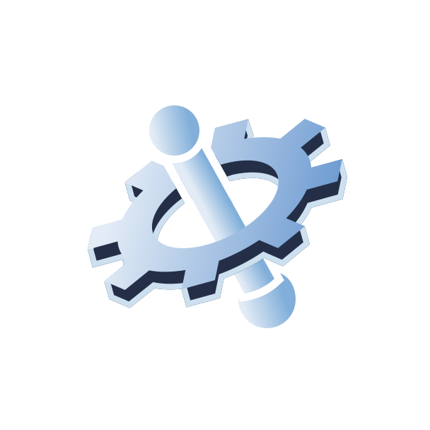
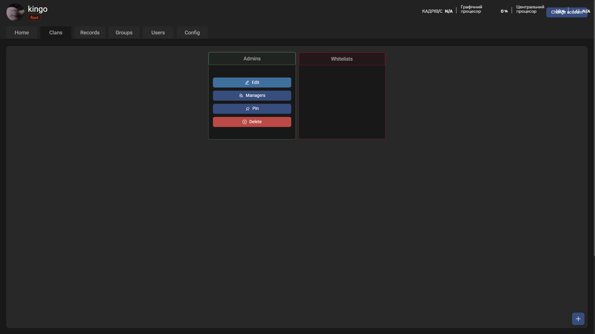
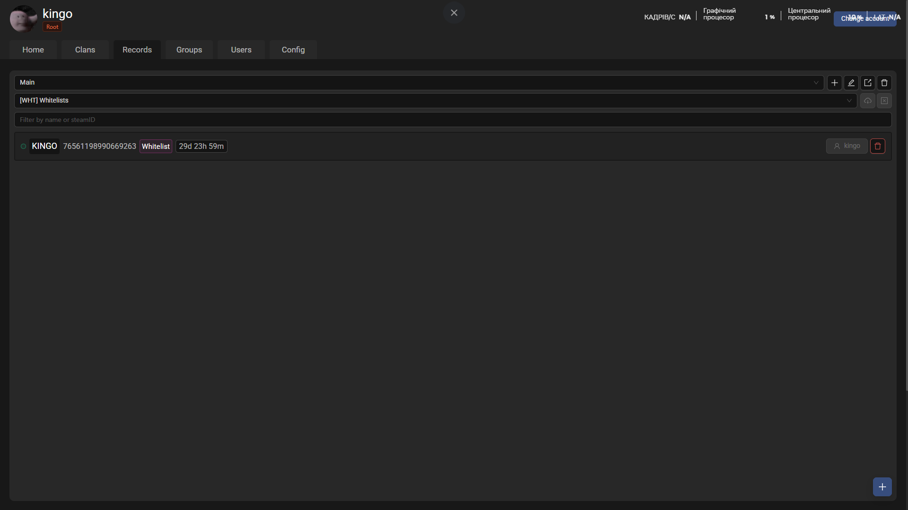
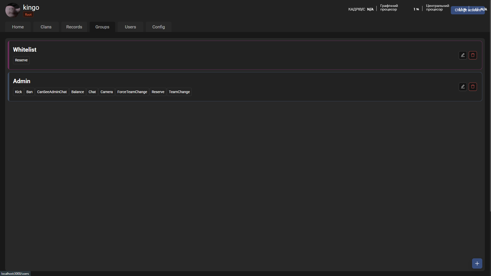
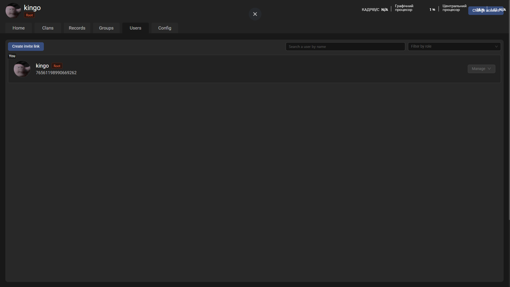
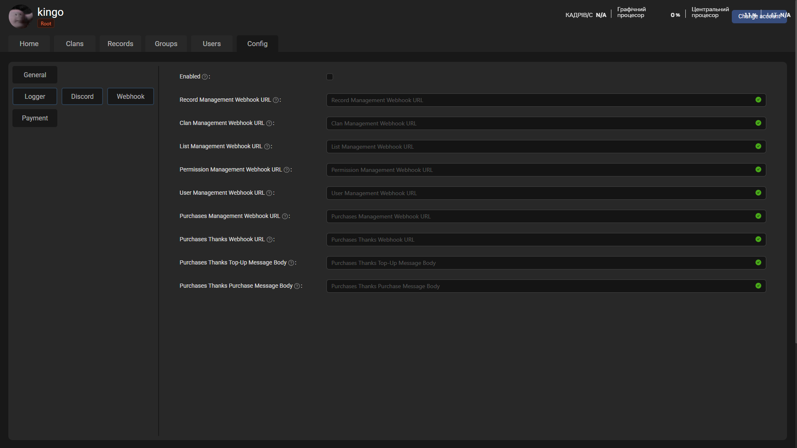
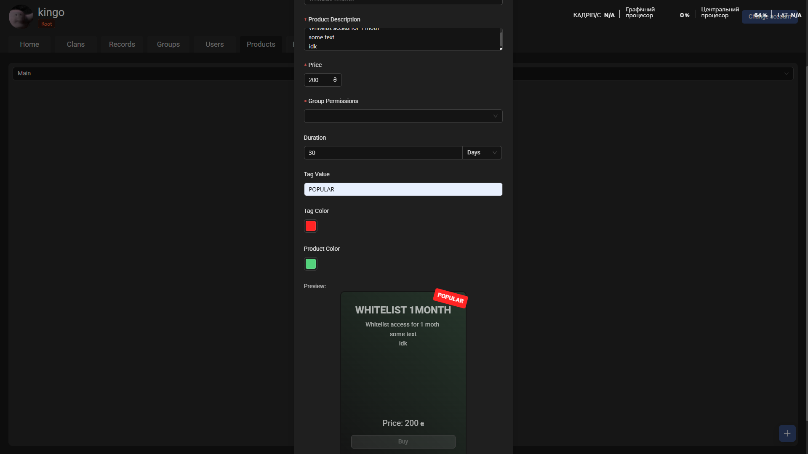
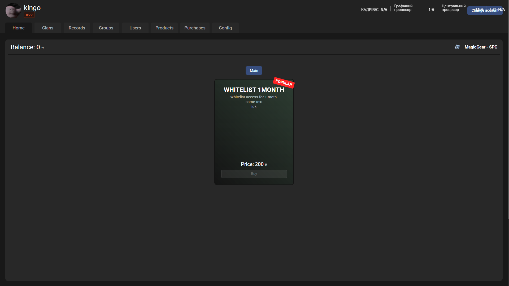

<p align="center">
  
</p>

<h1 align="center">SPC (Squad Permission Control)</h1>
<h1 align="center">Navigation</h1>

<p align="center">
    <a href="#tech-stack">Tech Stack</a>
    <a href="#features">Features</a>
    <a href="#installation_&_startup">Installation & Startup</a>
    <a href="#screenshots">Screenshots</a>
</p>

## Tech Stack

**Client:** React, Tanstack Query, Zustand, Axios

**Server:** Node, Nest.js, TypeORM, PostgresSQL, Passport.js


## Features

- **Steam authentication**.
- Role-based access control.
- **Clan role limits.** Specify the maximum number of each role that a clan can have!
- ClanLeader management. Assign one or more ClanLeaders to a clan.
- **Logging.** Log only what you need and where you need it using one of the available loggers. (only Discord Webhook Logger available now)
- **Purchase system**. Allows you to create a list of products that can be purchased by users.
- **Product customization**. Customize the product as you like. (Name, Description, Price, Color and Tag! etc.)
- **Stripe integration**. Set up your Stripe account and start receiving payments from top-ups.
- **Purchase management**. Deactivate, activate, edit purchases.
- Permission management. Create, edit, delete permissions.
- List management. Create, edit, delete lists.
- Clan management. Create, edit, delete clans.


## Installation & Startup
The installation with <a href="https://www.docker.com/get-started/">Docker</a> and <a href="https://docs.docker.com/compose/">Docker Compose</a> is only shown here, as this is the fastest and most optimal method


### Prerequisites

Ensure the following tools are installed on your machine:

- [Docker](https://docs.docker.com/get-docker/)
- [Docker Compose](https://docs.docker.com/compose/install/)

Verify installations:
```bash
docker --version
docker-compose --version
```
### Step 1: Download latest release archive

Download the latest release archive from the [releases page](https://github.com/1KINGO1/squad-spc/releases/latest)

### Step 2: Unpack the archive

If you are using Linux, you can use the following command to unpack the archive:

```bash
unzip release.zip
```

### Step 3: Specify ENV variables
There is some environment variables that you need to specify in the `.env` file.

- `HOST` - Enter the IP address of the server where the application will be hosted or domain (Without http://)
- `STEAM_API_KEY` - Enter your Steam API key (You can get it [here](https://steamcommunity.com/dev/apikey))
- `JWT_SECRET` - Generate a random string and enter it here 
(**Important!** This key is used to sign the JWT tokens, attackers can easily gain uncontrolled access if you do not specify a different value here)
- `PORT` & `DB_PORT` (Optional)

### Step 4: Build and run the application
Use the following command to build and run the application:
```bash
docker compose up -d
```

## Screenshots








